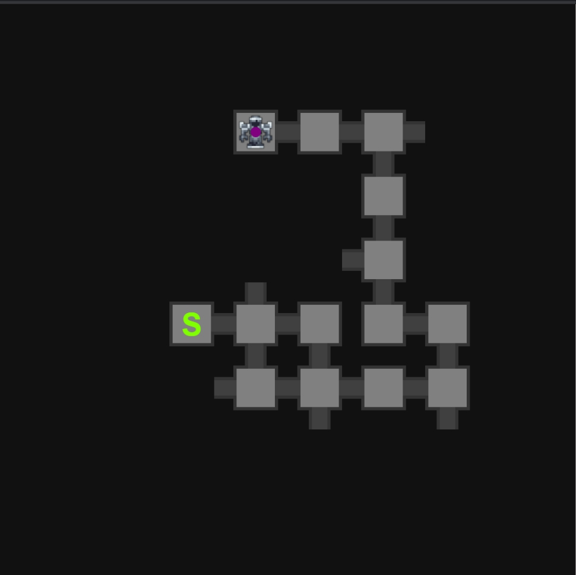

# Lost Halls Map Reading Guide

## Preface

Before explaining anything in the map reading guide it is good to preface this with noting that map reading is not guaranteed. You are not guaranteed to hit a 0 pot every run when leading. These rules and guides are there to help you make the best educated guess on which path is defender and which paths are pot splits. Sometimes the correct call in a run is the wrong path and vice versa.

Map Reading Rules That Are Always True - Defender

1. There are 9 rooms in-between spawn and defender.
2. When a lost halls map is generated, it first starts with generation of spawn, the main branch is then generated to defender. As the path is generating splits are then placed on the map. Due to the way this generation occurs; when you find a split on main branch that means you are on the way to defender.
3. There can be a maximum of 1 loop in a map with that loop only being able to be placed on main path.
4. A loop is counted as 1 room in the 9 room path to defender.
5. There are a maximum number of 6 splits in a map; this includes T-Room.
6. Rooms in halls can only be up to 4 rooms away from spawn in any direction. A border limiting where rooms can be placed is generated if there is any space after the 4th room. Maps are symmetrical, so if there is a border on the top wall, then there will also be one on the bottom wall. The same applies to left and right walls.
7. MBD(1x3) and MBC(2x3) combined occupy a 3x3 space in a map.

Map Reading Rules That Are Always True- Splits

1. There are a minimum of 1 and maximum of 2 enemy spawn rooms in-between the split and the pot room. This leaves the maximum number of rooms on a split to 3 rooms.
2. T-Room can only be entered from below the room.
3. There can never be a split the room before T-Room or any pot room as splits are only generated off of main branch.
   Map Reading Rules That Are Generally True
4. Generally defender will be placed away from where a majority of your splits are heading.
5. Usually the map will have a path reach or be close to each border of the map.
6. If T-Room is spotted 2 or more rooms from where you are on the map, it is generally a good idea to head in that direction as T-Room is a split off main branch.

### First Step in Map Reading

When first starting in map reading it is important to know that everyone makes mistakes and the best thing to do is to analyze and learn from one's mistakes. In addition to this; it takes time to gain the experience to consistently lead quality runs, so do not rush into things to complicated for yourself starting out.

Starting off the first step in map reading is to simply head in the direction with the most space. As you get into the habit of simply looking at your map and the space presented on the map we can then move onto the next step; consideration of past splits.

#### Step One: Map Example One

Looking at this map starting off we are going to go up. We are going to go up based off the rule that splits are only generated off main branch so any room with more than one pathway is a room on main branch. After deciding to head up from there we are simply going to follow the first rule to follow when starting to map read; heading where the most space is. So we go up.

After following the path we then get to another split. We are going to continue along the path with the most space, so we head left to defender.

### Second Step in Map Reading

First before discussing our past splits, lets discuss what is a split. A split is a path that is generated off of main branch where a pot room or T-Room is inevitably placed at the end. These rooms have a minimum of 1 room and a maximum of 2 rooms between main branch and the final pot room/T-Room. The way to look at a split is that the presence of a split and the lack of presence of a split can be an indicating factor for where defender can be placed. The reason to this is that as explained previously lost halls map generation starts with in order: spawn, path to defender, and then your splits. This means that a majority of splits will never be placed around where defender is, this is due to the fact that splits are going to usually want to be placed in the easiest location possible. This means that generally splits aren't going to want to be cramped extremely close to each other if there is plenty of space with more possibilities where they can be placed. In addition to this, even if a split is placed near defender it will generally be placed closer to the end of the main branch and be running along side defender's placement.

After understanding exactly what a split is, it's now time to be considerate of where these splits are being previously placed. A good way to practice this starting out is to simply head in the opposite direction of where previous splits are heading. Starting off in spawn we head towards where the most space is. After we start on this we then are always double checking where splits are heading. If we see two paths heading up and one path heading down then we go down.
Once you get a handle on this, try to then do this while visualizing the potential space a split can occupy. This will then help you in the next step of consideration of future splits. Splits placed take up space on the map and that space is generally away from MBD; visualizing the space they take up is a further emphasis on heading away from where they're heading. The idea of "heading to where the most space is" then gets changed to, "head to the space where MBD has the most potential positions to be placed". An area of the map where 3 splits are heading has less potential than an area where only 1 split is heading.

#### Step Two: Map Example One

This map is just an example of how lack of splits is also an indication of where defender could be placed. Due to the distinct lack of splits going along the 3 room section that is highlighted by the green line; you can place defender near perfectly in that space. Remember that splits are generated after defender so it makes sense that no splits would be heading towards the space where defender is. Due to this you can see spaces in which there is a very large lack of splits where defender is being placed.

#### Step Two: Map Example Two

This map is just another map that highlights the topic discussed by Example One

#### Step Two: Map Example Three

Looking at the beginning room starting off we are going to head up, this is based off the split rule as previously explained in the rules and on map one. As we do not have any information on splits going left and there are two splits going up; we are going to go towards the most space with the least amount of splits heading which is left.

As we get to this split we look at our map again, always look at your map as you get to each split to analyze where your previous splits are heading and where that leaves you with room to move; as we have 3 splits going up we go down.

Now, looking at this decision the are of the map that has the most space may seem to be the down space, however there is a previous split that goes down into that area of the map; so in all reality the top right space has the most space available to place defender. However, there are three up splits previously. This may seem like you would want to go down as there are simply less splits heading into the down direction, however this is where the visualization that I discussed was brought up. Two of the previous up splits are so far up and to the right that the chance that they interfere with defender's space is very low in comparison to the previous right split that is far closer to where defender would be placed. Due to this we head left and then eventually make the decision to go up based off this information.

### Third Step in Map Reading

The next step to look into learning after being considerate of your previous splits; is the ability to skillfully estimate where defender will be on the map. In addition to this, it is very important in this step to be able to maintain a feeling of how far you are along main branch. This realistically doesn't mean you should be room counting but, it is very important to be able to have the ability of knowing whether you're about half way or very close to defender. The two of these almost go hand in hand, because to be able to estimate where defender is, one will need to be able to visualize the general path to defender.

The reason this step falls after the second step is due to the visualization that is needed for this. After being able to successfully visualize where splits are heading, you should be able to see how those splits limit and affect the areas in which defender can be placed when considering the remaining room count.

The practical way to use of these skills, is looking at the space with the most potential to place defender. This space as explained in Step Two is the area of the map with the most space where there are the least amount of splits heading. This gives you a starting idea of where to head; this should not be where you expect defender to end at. You should always be ready to adjust your idea of where defender is based off where the splits are placed on the map. Limiting yourself to this first initial placement will result in what is called "Tunnel vision".

#### Step Three: Map Example One

The first thing to do as previously explained in the explanation before, the potential positions where defender can be placed based off the available space is; top right, top left, and bottom right. Taking into account our room count of one room after we decide to head into the split on the right; we can determine that bottom right is the least likely and can now say that the top two positions are the most likely.

Going based off of the steps previously discussed, the next step to take would be to head into the area of the map with the most space. This however is quite difficult as the space is quite even on the right and top side of the map. However, now that we are now being considerate of our roomcount that we need to get to defender, which is 9 rooms. Going up into the top side of the map would not give us enough roomcount before we get to the ideal positions we want to be at which are top left or top right. So instead we are going to go right and then use the consideration for split rule, or step two in our decision making.

So based off the previous decision to head right, we then are going to continue to use the things learned in Step Two to make the decision on where to go. We have 2 previous down splits so we decide to go right. Once we get to this split we should for sure change our idea of where defender is from top left to top right/mid. This is due to the rooms we need to place before we get to defender which is still about half the map. The top left position is simply too far away and would need us to place more than the allowed rooms on main branch.

After looking at all the previous splits the best decision is to go up at the up and down split as you have 3 down splits and only one up split.

After reaching this next split, you should have the feeling that you are quite far into the lost halls, and don't have that many rooms left until you're at defender. This split is a test of the ability to consider your roomcount in addition to visualizing the space splits take. As you don't have that many rooms left going up would be a poor decision as the left split would likely be forced up into the space where defender would be placed. This is due to the previous up split.

### Fourth Step in Map Reading

The next step in map reading is consideration of future splits. This is something that many people struggle with in map reading and there will be many examples placed further in the guide. When learning map reading lessons, you should start off small and slowly add things to that small building block. The reason to practice visualization of splits in the second step is so that it is easier to consider future splits in this step. If you haven't begun practicing that visualization it is suggested that you do so before continuing.
The reason why consideration of future splits is so important and arguably one of the most important things one can do second to consideration of previous splits; is that defender's placement on the map is determined by where the splits are placed. Splits are generated prior to defender and need adequate space to place the entirety of the split. Keeping this in mind, this once again adds meaning to the improved rule introduced in the second step, "head to the space where MBD and splits have the most potential positions to be placed". Map reading is all about what path has the best chance to arrive at defender, and consideration of future splits simply adds to that.

When looking at a map there is generally two different types of space that you will see. There will be the space that has the most potential positions for defender, and the second type of space you will see is the space that you know you can't put defender and this space would also have the most potential positions for splits. Something to think about when looking at these types of spaces especially the space with defender placed inside; you can't cut that area in half when you are very early in the halls especially when you need to still place a decent amount of rooms and splits. Doing so would result in a path that is quite unrealistic and cramped as a result. This would be considered cutting in too early. Usually when you have the opportunity to "cut in too early", generally you will loop around one split. Sometimes you will loop around a single split, however looping around 2 splits is highly unlikely.

#### Step Four: Map Example One

When looking at this map, the two space types we have present, are the space to place defender and the space to place splits. The space to place splits is bottom right, and the space in which defender is going to be located is at the top side of the map. Looking at the potential directions we can head at this first split, yes the up does get us in the top of the map where we want to be. However it gets us there too early as we would need to place 8 more rooms and 4 more splits off main path. The space would be entirely too crowded to place all of that up there, so the better decision would in fact be the right split. The right splits gives plenty of space on the bottom right of the map to place splits in addition to the right side of the map if it decides to head up.

We go right and down through the loop and continue to head in the right direction as the left simply would not give any room for splits or MBC as there is an up split, and the up split was already determined to be a worse decision. The down path is simply a very poor decision, there is very little room for splits and room count; and in addition to this utilizing the split visualization as discussed in step two you could see that the right would cut off any chance for the down to go right and up. This emphasizes the idea that there is always a right call in a loop, if the two paths were two seperate splits think of the situation as what would the right decision be.

We now know that MBD is not going to be in the top right corner as we have the too many rooms to place before defender in order to put defender in the top right space. So heading to the top left what path is the best decision. When considering whether a path is the path to defender, overall you are considering which path has the most potential. Whether that potential is split placement, MBC placement, potential for roomcount, etc... Overall it is consideration for the best possible potential. When looking at this situation you have placed a total of 5 splits which means you need to place one more split. There are a total of two ways to look at this situation correctly.

The first way to look at this situation is to go left. Going left you could go left, up, left, and then place your split going up. This could be viewed as the path of least resistance for placing MBD as you don't have to go around two splits and you are quite far into the halls.

There is then the other view of this in which that is a very cramped space for all your splits and defender in the area as they would be all close to each other. meanwhile you could go up and left, while placing your remaining split right. This would leave your remaining split going towards a space that is most ideal, however you do have to be considering that there are two splits that have the potential to interfere with defender going up as they go both are likely to head up.

### Fifth Step in Map Reading

The fifth and final step in map reading once considering and utilizing the previous four steps is not so much a step of what to do next but, things to consider and keep in mind when leading. The final things to keep in mind when leading are; you will generally have a room in every map touch every wall of the map and keeping your 4 room border in-mind when making a decision.

Generally the map will have a room touch every border of the map and if you're at a point in which you're about half way through the map and if you were to head into one direction that would lead you to not touch one of the borders, that direction will likely be the wrong direction.

The map will always generate borders dependent on the 4 room rule. This border changes not by the spawn of those rooms but by the shift of spawn. Whether spawn is shifted off center in specific directions changes the borders and in addition to this change where your two types of spaces are. If spawn is shifted more up, the space for defender will most likely be down; meanwhile if spawn is shifted down the space for defender will be most likely up.

### Final Note

As a final note it is suggested that despite this being considered a quite thorough map reading guide, you should not expect after reading this once to become a "god" at map reading all of a sudden. Map reading takes time and practice to get better at, and you should not expect to be able to get good overnight. It is okay to make mistakes and as long as you can reasonably explain your thought process for why certain directions were wrong or right you are doing a good job. Look at your mistakes and try to learn from them and do not take feedback personally as everyone has a different perspective. Remember to go into runs and get experience and have fun map reading!
